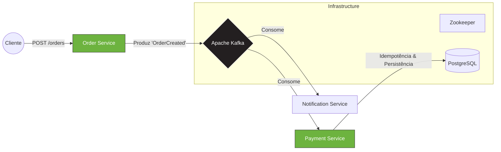

# Event-Driven Architecture (EDA) com Spring Boot & Kafka


Este repositório é uma implementação de referência de uma arquitetura de microsserviços resiliente e assíncrona.

O objetivo não é apenas "conectar o Kafka", mas demonstrar como resolver problemas reais de sistemas distribuídos, como **idempotência**, **garantia de entrega**, **tratamento de falhas (DLQ)** e **observabilidade**.

---

## 🏗️ Arquitetura do Sistema

O sistema simula um fluxo de E-commerce onde a criação de um pedido dispara processos paralelos e desacoplados.



### Fluxo de Dados

1. **Order Service (Produtor):** Recebe a requisição REST, valida e publica um evento `OrderCreatedEvent`. Utiliza `acks=all` para garantia de durabilidade.
2. **Broker Kafka:** Armazena o evento no tópico `orders-topic` garantindo a ordem via *Partition Key* (`orderId`).
3. **Payment Service (Consumidor):** Processa o pagamento com padrão de **Consumidor Idempotente** para evitar cobranças duplicadas.
4. **Notification Service (Consumidor):** Envia notificações de forma independente.

---

## 📂 Estrutura do Projeto e Onde Encontrar o Código

O repositório está organizado como um *monorepo* para facilitar a execução, mas cada pasta representa um microsserviço isolado.

```bash
/
├── docker-compose.yml           # Infraestrutura (Zookeeper, Kafka, Kafka UI, DB)
├── order-service/               # [PRODUTOR] API de Pedidos
│   ├── src/main/java/.../
│   │   ├── config/              # Configuração do Kafka Producer (Acks, Serializer)
│   │   ├── controller/          # Endpoint REST (Entrada)
│   │   ├── service/             # Lógica de envio assíncrono com Callbacks
│   │   └── events/              # Contrato do Evento (OrderCreatedEvent)
│
├── payment-service/             # [CONSUMIDOR] Processamento de Pagamentos
│   ├── src/main/java/.../
│   │   ├── service/             # @KafkaListener e Lógica de Idempotência
│   │   ├── model/               # Entidades JPA (Payment, ProcessedEvent)
│   │   └── config/              # Configuração de DLQ e Tratamento de Erros
│
└── notification-service/        # [CONSUMIDOR] Envio de E-mails
```

### 🔍 Destaques de Código (Onde olhar)

| Recurso                      | Arquivo / Local                              | Descrição                                                                          |
| ---------------------------- | -------------------------------------------- | ---------------------------------------------------------------------------------- |
| **Configuração do Produtor** | `order-service/.../KafkaProducerConfig.java` | Configuração de `acks=all` e `enable.idempotence` para durabilidade.               |
| **Consumidor Idempotente**   | `payment-service/.../PaymentListener.java`   | Implementação do padrão de deduplicação usando tabela de controle no banco.        |
| **Dead Letter Queue (DLQ)**  | `payment-service/.../KafkaConfig.java`       | Configuração do `DefaultErrorHandler` para repassar mensagens falhas após retries. |
| **Correlação de Logs**       | `application.yml` (Todos)                    | Configuração do Micrometer Tracing para injetar `traceId` nos logs.                |

---

## 🚀 Como Rodar Localmente

### Pré-requisitos

* Java 17+
* Docker & Docker Compose
* Maven ou Gradle

### Passo 1: Subir a Infraestrutura

```bash
docker-compose up -d
```

> **Acesse a UI do Kafka:** `http://localhost:8090`

### Passo 2: Rodar os Microsserviços

```bash
# Terminal 1
cd order-service && ./mvnw spring-boot:run

# Terminal 2
cd payment-service && ./mvnw spring-boot:run

# Terminal 3
cd notification-service && ./mvnw spring-boot:run
```

### Passo 3: Disparar um Evento

```bash
curl -X POST http://localhost:8080/api/orders \
-H "Content-Type: application/json" \
-d '{"userId": "user-123", "amount": 150.00}'
```

---

## 🛠️ Tecnologias Utilizadas

* **Spring Boot 3.5.7**
* **Spring Kafka**
* **Apache Kafka**
* **H2 / Postgres**
* **Micrometer & OpenTelemetry**
* **Lombok**
